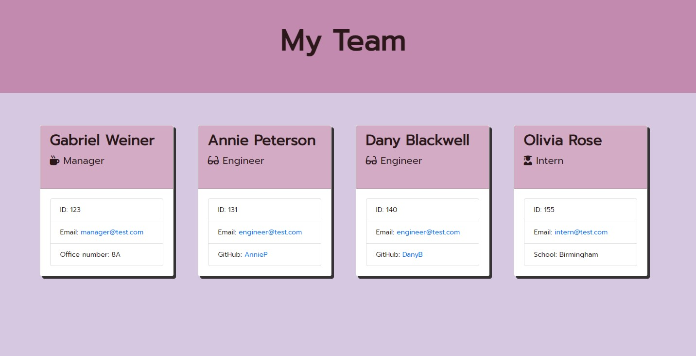

# Team Profile Generator

## Object-Oriented Programming

This application is a Node command line application that dynamically generates the team member profile HTML webpage, that displays summaries for each person from the user's input. 

## Table of Contents

* [Installation](#installation)
* [Usage](#usage)
* [License](#license)
* [Questions](#questions)

## Mock-Up

The following image shows a mock-up of the generated HTML’s appearance and functionality:



Check out [here](https://soradaw.github.io/Team-Profile-Generator/) for live example.

## Installation

Here are some guidelines:

* Create new repository in GitHub, then `git clone` to your local.

* Create a `.gitignore` file and include `node_modules/` so that your `node_modules` directory isn't tracked or uploaded to GitHub.

* Make sure that your repo includes a `package.json` with the required dependencies. You can create one by running `npm init` when you first set up the project, before installing any dependencies.

* Run `npm install` in order to install the following npm package.

  * The application use `Jest package` for running the unit tests.

  * `Inquirer package` for collecting input from the user. 

* Once you have `npm install` your dependencies, you can run the Node CLI application with `npm start` and you can run `npm test` at anytime.

* The application will be invoked by using the `node index.js` command.

## Usage

  * Code in `index.js` uses inquirer to gather information about the development team members and creates objects for each team member using the correct classes as blueprints.
    * When a user starts the application then they are prompted to enter the **team manager**’s:
      * Name
      * Employee ID
      * Email address
      * Office number
    * When a user enters those requirements then the user is presented with a menu with the option to:
      * Add an engineer
      * Add an intern 
      * Finish building the team
    * When a user selects the **engineer** option then a user is prompted to enter the following and then the user is taken back to the menu:
      * Engineer's Name
      * ID
      * Email
      * GitHub username
    * When a user selects the intern option then a user is prompted to enter the following and then the user is taken back to the menu:
      * Intern’s name
      * ID
      * Email
      * School
    * When a user decides to finish building their team then they exit the application, and the HTML is generated.

The directory structure of the application as follows:

```
docs/     // Rendered HTML output
lib/      // Employee classes and code to generate HTML 
src/      // Templates for main HTML <body> and employee <div>s
tests/    // Jest tests
index.js  // Runs application (inquirer prompts and main functions)
```

## Questions

* A sample HTML file generated using the application click [here](https://soradaw.github.io/Team-Profile-Generator/)

* Any questions please send me an [email](sorada.wright@gmail.com)

## License

This project under the terms of MIT License

---
© 2023 | Sorada Wright | All Rights Reserved.
